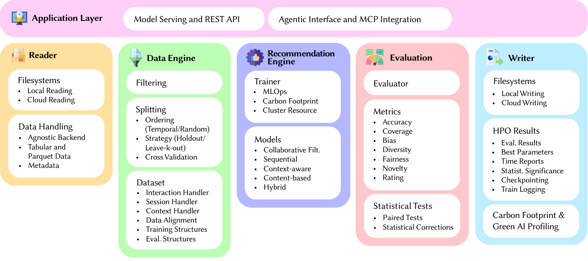

# Architecture

WarpRec is designed around principles of **modularity** and **separation of concerns**. Five decoupled engines manage the end-to-end recommendation lifecycle, from data ingestion to model evaluation. An Application Layer exposes trained models through a REST API and an MCP agentic interface.

This architecture allows researchers to inject custom logic, swap data backends, or integrate individual modules into external pipelines, all without modifying the core framework.

---

## The Four Pillars

WarpRec is built on four foundational principles that distinguish it from existing frameworks.

### Scalability

WarpRec ensures strict code portability from local prototyping to industrial deployment. The framework supports execution from single-node to multi-GPU configurations, leveraging [Ray](https://docs.ray.io/) for multi-node orchestration. This integration enables elastic scaling across cloud infrastructures, optimizing resource allocation and reducing computational costs. A model trained on a laptop can be deployed to a Ray cluster without changing a single line of configuration.

### Green AI

WarpRec is the first Recommender Systems framework to enforce ecological accountability by natively integrating [CodeCarbon](https://mlco2.github.io/codecarbon/). Every training trial can be profiled for real-time energy consumption (CPU, GPU, RAM) and CO2 emissions, enabling researchers to report the environmental cost of their experiments alongside traditional performance metrics.

### Agentic Readiness

Anticipating the shift toward autonomous systems, WarpRec natively implements the [Model Context Protocol (MCP)](https://modelcontextprotocol.io/) server interface. This transforms the recommender from a static predictor into a queryable tool that LLMs and autonomous agents can invoke dynamically within their reasoning loops, bridging the gap between recommendation and conversational AI.

### Scientific Rigor

WarpRec automates reproducibility and statistical validation. The evaluation suite includes paired tests (Student's t-test, Wilcoxon signed-rank) and independent-group analyses (Kruskal-Wallis, Mann-Whitney U), with automatic corrections for the Multiple Comparison Problem via Bonferroni, Holm-Bonferroni, and FDR (Benjamini-Hochberg) methods. All stochastic operations are anchored to global random seeds.
