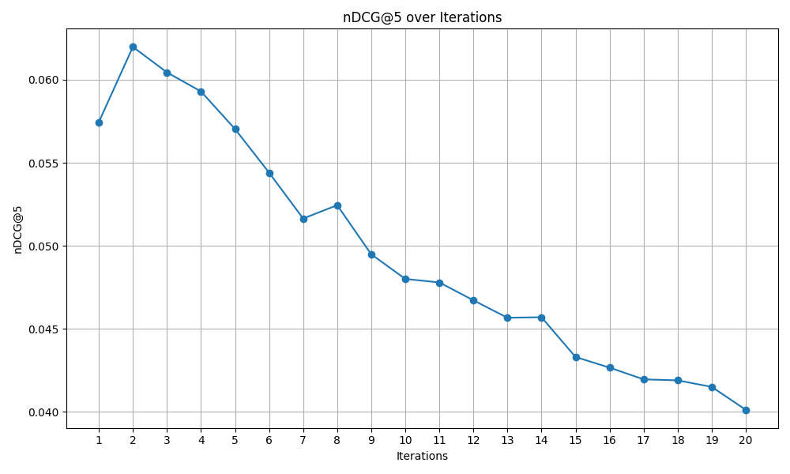

# 🛠️ [WarpRec](../../README.md) Utils

The `utils` module of WarpRec provides a collection of essential utilities designed to simplify the definition and execution of recommendation experiments via configuration files. These tools help make experiments reproducible, maintainable, and extensible.

## 📚 Table of Contents
- ✨ [Main Functionalities](#✨-main-functionalities)
- 📂 [Module Structure](#📂-module-structure)
- ⚙️ [Config](#️⚙️-config)
    - 🚀 [Quick Start](#🚀-quick-start)
- 🧾 [Logger](#🧾-logger)
    - 🔧 [Key Features](#🔧-key-features)
- 📞 [Callback](#📞-callback)
    - 👉 [How to implement Your callback](#👉-how-to-implement-your-callback)
    - 📚 [Available callbacks](#📚-available-callbacks)
- 🧩 [Enums](#🧩-enums)
- 📦 [Registry](#📦-registry)


## ✨ Main Functionalities

- **⚙️ Configuration**: Defines the foundation for experiment reproducibility and modularity. Configuration files allow users to control all aspects of the pipeline (e.g., model selection, data splitting, hyperparameters) without modifying the underlying code.
- **🧾 Logger**: A flexible and extensible logging utility designed to provide consistent output across modules. It supports both console and file-based logging, with customizable formats and verbosity levels.
- **🧩 Enums**: A centralized collection of enumerations used throughout the framework, which ensures readability, type safety, and code consistency.
- **📦 Registry**: A core component enabling dynamic access and instantiation of key objects—such as models, metrics, splitters, or optimizers—based on configuration references. This design supports decoupling and extensibility across the framework.

## 📂 Module Structure

The module `utils` is structured as follows:

- **[`config`](config/README.md)**: Contains classes and functions to parse, validate, and manage configuration files. It supports default values, nested configurations, and integration with environment variables.
- **[`logger`](logger/logger.py)**: Provides a customizable logging interface used throughout WarpRec. It enables seamless tracking of experiments, debugging information, and system warnings/errors.
- **[`enums`](enums.py)**: Defines common enumerations used in WarpRec, including model types, dataset formats, splitter strategies, and more. These enums are used to validate user inputs and standardize behavior.
- **[`registry`](registry.py)**: Implements a lightweight registry pattern to manage dynamically loadable components. It simplifies the addition of custom elements (e.g., new loss functions or metrics) by automatically registering them for discovery at runtime.

## 📌 Example Usage

### ⚙️ Config

The `config` module provides all the utilities needed to define a **configuration file** for your experiments. In the quick start section, we explain how to run a simple experiment with your data.

#### 🚀 Quick Start

First of all, let's create a simple configuration file. Here's how you can do it:

```yaml
reader:
    loading_strategy: dataset
    data_type: transaction
    reading_method: local
    local_path: path/to/your/dataset.csv
    rating_type: implicit
    sep: ','
writer:
    dataset_name: MyDataset
    writing_method: local
    local_experiment_path: experiment/test/
splitter:
    strategy: temporal_holdout
    test_ratio: 0.1
models:
    ItemKNN:
        k: 10
        similarity: cosine
        normalize: False
evaluation:
    top_k: [10, 20, 50]
    metrics: [nDCG, Precision, Recall, HitRate]
```

To run an experiment with this configuration, just run the following:

```bash
python warprec/train.py --config path/to/the/config.yml
```

That's it! You're ready to go. This will get you started with the WarpRec configuration files. For a more in-depth description of all the possible configurations you can make, use **[`config`](config/README.md)** as reference.

### 🧾 Logger

The `logger` module provides a unified interface to log messages across your entire experiment pipeline.

You can easily initialize a logger with your preferred configuration:

```python
from warprec.utils.logger import get_logger

logger = get_logger(name="train", level="INFO")

logger.info("Training started")
logger.warning("This is a warning")
logger.error("An error occurred")
```

Or you can just use the ready-to-go logger used by WarpRec:

```python
from warprec.utils.logger import logger

logger.msg("This is a logger message")
logger.attention("Something might be wrong")
logger.error("Something is wrong")
```

#### 🔧 Key Features

- Console logging.
- Configurable logging levels.
- Timestamped and formatted output for easier debugging.

### 📞 Callback

WarpRec offers customizable `Callback` functionality. When using the framework, you can either start an experiment via a configuration file—accessing the main training/inference pipelines—or use a custom script to directly access WarpRec's inner components.

In some scenarios, you might want to apply minor changes to the workflow or perform additional computations during execution. This can be easily achieved using WarpRec’s `Callback` system.

To use a custom callback within the main pipeline, you need to complete two steps:

- Create a script containing a class that extends the base `WarpRecCallback`.
- Add the callback definition to the configuration file. For more information on configuration, see [this guide](config/README.md)

That’s it! Below you’ll find a simple tutorial that will walk you through implementing a practical use case.

#### 👉 How to implement Your callback

Let’s start by defining the goal of our callback:

```raw
Train the NeuMF model for a specified number of epochs and track the nDCG score. Plot the score over training iterations to monitor progress and validate whether the model is learning effectively.
```

Now that we’ve defined the use case, let’s proceed to step one: creating the callback script. The full example is available [here](../../callbacks/my_callback.py).

```python
class ComputeNDCGOverIterations(WarpRecCallback):

    def __init__(self, *args, **kwargs):
        self._save_path = kwargs.get("save_path", None)
        self._ndcg_scores = []
```

This initializes the class by retrieving the plot save path from kwargs (we'll explain this further below) and creating a list to store the scores.

Next, let’s track the metric values at each iteration:

```python
    ...

    def on_trial_save(self, iteration, trials, trial, **info):
        ndcg_score = trial.last_result.get("score", 0.0)
        self._ndcg_scores.append(ndcg_score)
```

In WarpRec, Ray Tune saves the evaluation metric under the generic name `"score"`. In this simple scenario, where only one metric is tracked, we assume that `"score"` corresponds to the nDCG value.

In more complex scenarios, you might instead instantiate an `Evaluator` and compute multiple metrics as needed.

Finally, let’s create and save the plot:

```python
    ...

    def on_training_complete(self, model, *args, **kwargs):
        iterations = list(range(1, len(self._ndcg_scores) + 1))
        plt.figure(figsize=(10, 6))
        plt.plot(iterations, self._ndcg_scores, marker='o', linestyle='-')

        plt.title('nDCG@5 over Iterations')
        plt.xlabel('Iterations')
        plt.ylabel('nDCG@5')
        plt.grid(True)
        plt.xticks(iterations)
        plt.tight_layout()

        if self._save_path:
            try:
                plt.savefig(self._save_path)
                print(f"Plot successfully save to: {self._save_path}")
            except Exception as e:
                print(f"Error during the saving process in {self._save_path}: {e}")
            plt.close()
        else:
            plt.show()
```

That’s it! You’ve now integrated a custom callback into the main training pipeline.

The last step is to register the callback in the configuration file. Here's an example:

```yaml
general:
  ...
  callback:
    callback_path: callbacks/my_callback.py
    callback_name: ComputeNDCGOverIterations
    kwargs:
      save_path: plots/nDCG_over_iterations.png
```

You can pass custom `args` and `kwargs` to the callback via the configuration file. Note that WarpRec does **not** perform validation on these parameters—it is the user's responsibility to handle them correctly.

For this example, we used this configuration for the NeuMF model:

```yaml
NeuMF:
    mf_embedding_size: 64
    mlp_embedding_size: 64
    mlp_hidden_size: [32, 16, 8]
    mf_train: True
    mlp_train: True
    dropout: 0
    epochs: 20
    learning_rate: 0.0001
    neg_samples: 4
```

Here is the resulting plot from this example:



#### 📚 Available callbacks

WarpRec provides a set of built-in callbacks that are triggered at specific stages of the pipeline. The table below lists the available callbacks:

| Callback name        | Origin    | Description                       | Reference                         |
| -------------------- | --------- | --------------------------------- | --------------------------------- |
| on_dataset_creation  | WarpRec   | Invoked after dataset creation.    | [WarpRecCallback](callback.py)    |
| on_training_complete  | WarpRec   | Invoked after model training completion.    | [WarpRecCallback](callback.py)    |
| on_evaluation_complete  | WarpRec   | Invoked after model evaluation completion.    | [WarpRecCallback](callback.py)    |

WarpRec callbacks also inherit all the lifecycle hooks defined by the Ray Tune `Callback` class. For more details on those, refer to the [Ray Tune documentation](https://docs.ray.io/en/latest/tune/api/doc/ray.tune.Callback.html)

### 🧩 Enums

`Enums` are used throughout the framework to enforce valid input values and enhance code readability. Here’s an example usage:

```python
from warprec.utils.enums import RatingType, Similarities

rating_type = RatingType.IMPLICIT
similarity = Similarities.COSINE

print(f"Rating type: {rating_type}, Similarity: {similarity}")
```

All enums subclass both `str` and `Enum`, making them human-readable and type-safe. You can use them in configs like:

```yaml
reader:
    rating_type: implicit
...
models:
    ItemKNN:
        similarity: cosine
```

For a full list of supported enums, check the **[`enums`](enums.py)** module.

### 📦 Registry

The `registry` module enables dynamic instantiation of components via configuration, following a plugin-like architecture.

You can register and retrieve classes easily:

```python
from warprec.utils.registry import metric_registry

@metric_registry.register(name="MyCustomMetric")
class MyCustomMetric:
    def compute(self):
        return "custom result"

# Instantiate via name
metric = metric_registry.get("MyCustomMetric")
print(metric.compute())  # Outputs: custom result
```

Registered classes can then be referenced from a config like:

```yaml
evaluation:
    metrics: [MyCustomMetric]
```

Use `.list_registered()` to see the currently available components.
